<h1 align="center">基于SpringBoot的人才招聘系统【带论文】</h1>

- <b>完整代码获取地址：从戎源码网 ([https://armycodes.com/](https://armycodes.com/))</b>
- <b>技术探讨、资料分享，请加QQ群：692619798</b>
- <b>作者微信：19941326836  QQ：3645296857</b>
- <b>承接计算机毕业设计、Java毕业设计、Python毕业设计、深度学习、机器学习</b>
- <b>选题+开题报告+任务书+程序定制+安装调试+论文+答辩ppt 一条龙服务</b>
- <b>所有选题地址 ([https://github.com/Descartes007/allProject](https://github.com/Descartes007/allProject)) </b>

## 一、项目介绍

基于SpringBoot的人才招聘系统，系统角色为普通用户(user)、管理员(admin)，主要功能如下
### 普通用户（user）：
- 基本操作：注册、登录（验证码）、修改密码、获取/修改个人信息、上传头像
- 简历管理：新增/编辑/保存简历、上传简历照片、查看个人简历详情
- 职位浏览：按条件检索职位（关键字、城市、学历、经验、发布时间等）、查看职位详情
- 公司查看：查看公司列表、公司详情
- 私信功能：与 HR/其他用户点对点聊天、查看聊天列表与未读信息
### 管理员（admin）：
- 基本操作：登录、修改密码、获取/修改个人信息
- 用户管理：分页筛选用户、查看详情、新增用户、修改/删除用户、锁定/解锁用户
- 公司管理：分页筛选公司、查看/编辑/删除公司、公司入驻审批、统计公司维度数据
- 岗位管理：后台分页筛选岗位、查看/编辑/删除岗位、岗位统计
- 简历管理：后台分页筛选/查看/删除简历
- 字典管理：管理城市/行业/字典类型与字典值（供前端下拉）
- 聊天管理：后台查看聊天记录、分页查询
- 仪表盘：系统汇总统计（用户数、简历数、公司数、岗位数、城市覆盖等）
### 公共功能/细节：
- 验证码支持（Kaptcha）用于登录/注册安全校验

## 二、项目技术

- 编程语言：Java
- 项目架构：B/S（Spring Boot 服务端渲染 + Thymeleaf 模板）
- 前端技术：Thymeleaf 模板、LayUI、jQuery（AJAX）

## 三、运行环境

- JDK版本：1.8及以上都可以
- 操作系统：Windows7/10、MacOS
- 开发工具：IDEA、Ecplise、MyEclipse都可以

## 四、数据库配置文件

- npm版本：6.14.13及以上都可以
- Redis版本：3.2.100及以上都可以
- 文件名：application.yaml
- 编码类型：utf8

## 论文截图

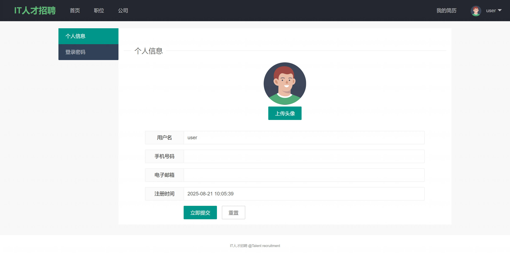

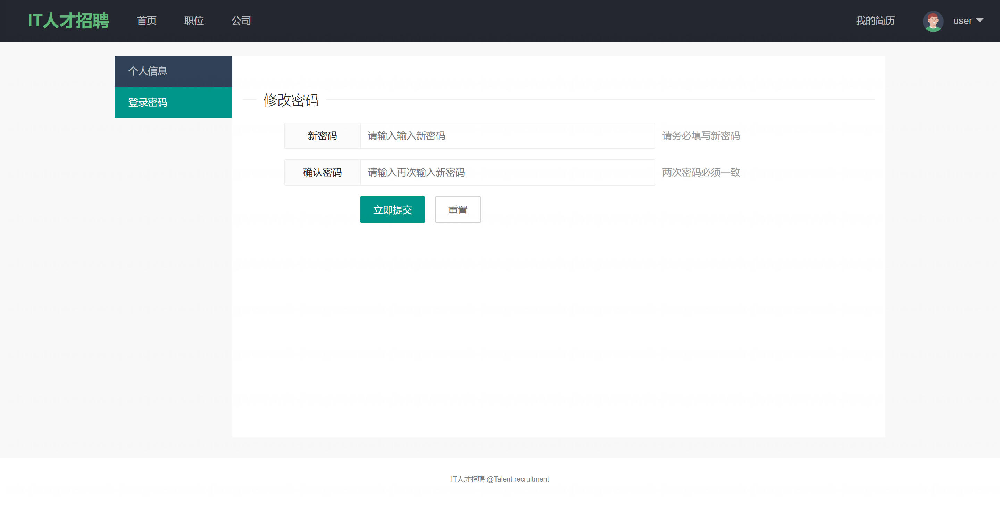

## 系统截图

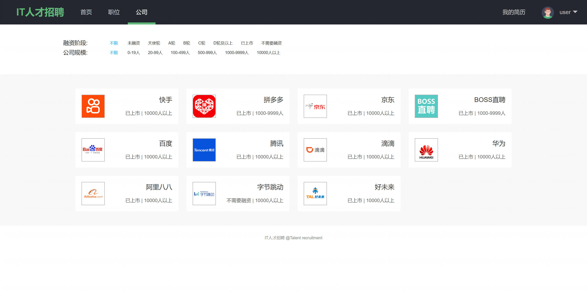

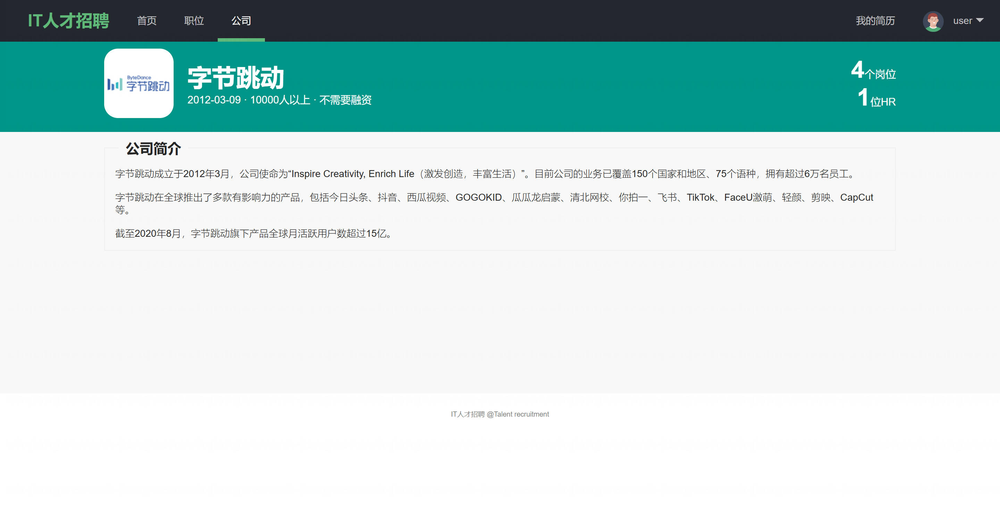

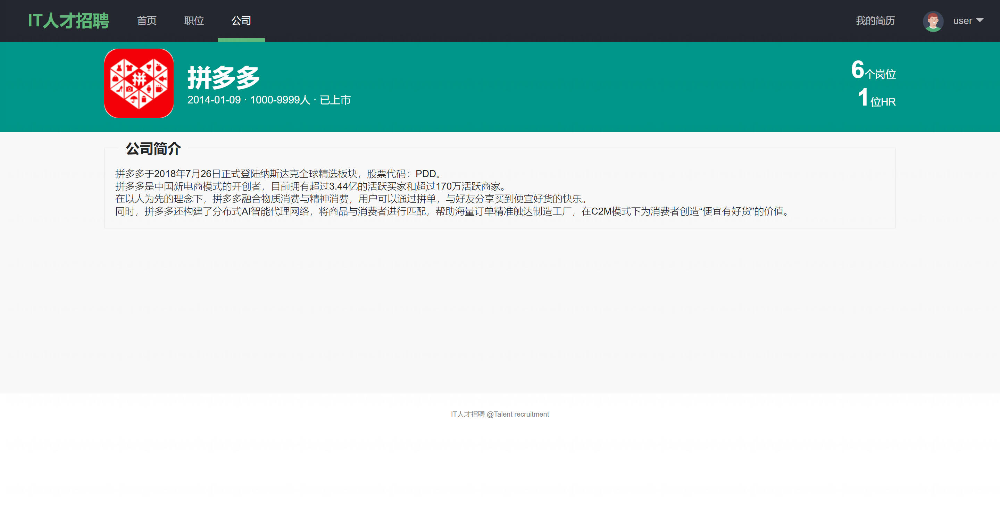

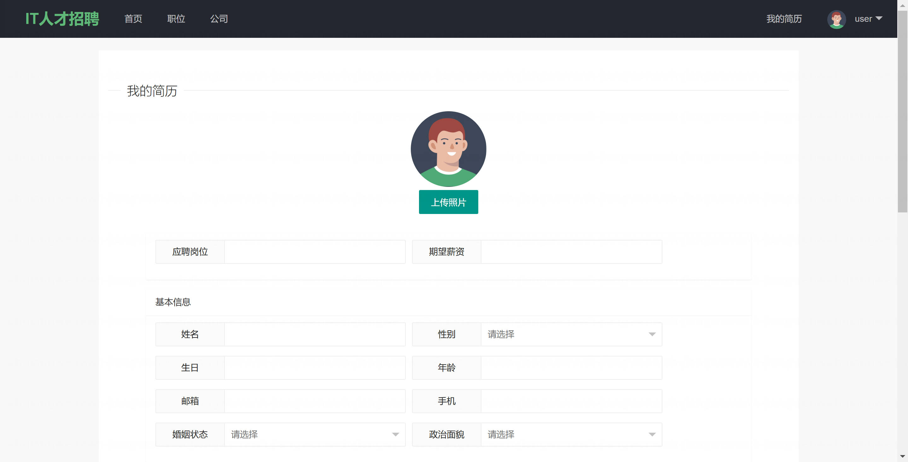

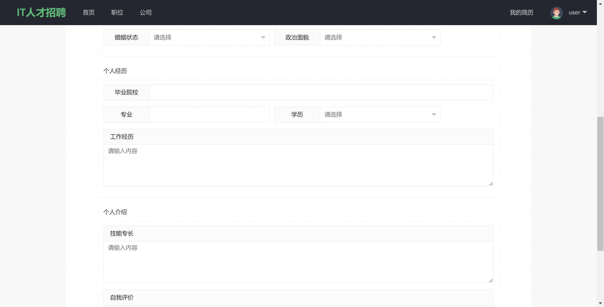

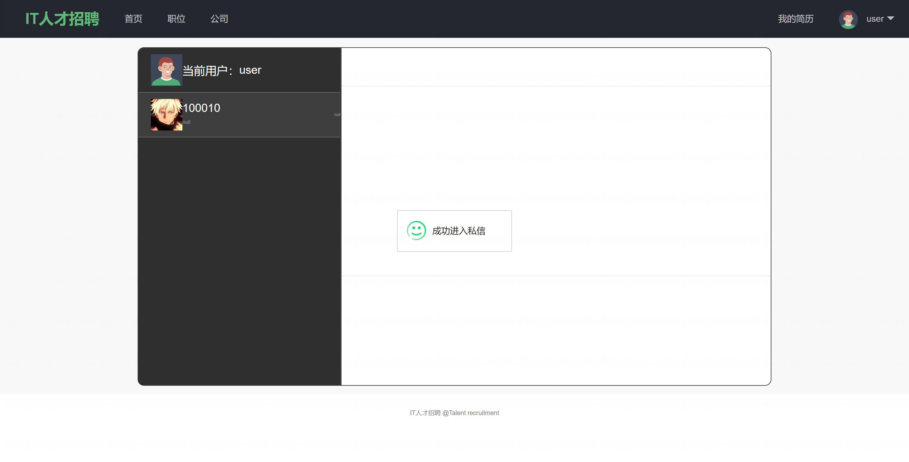

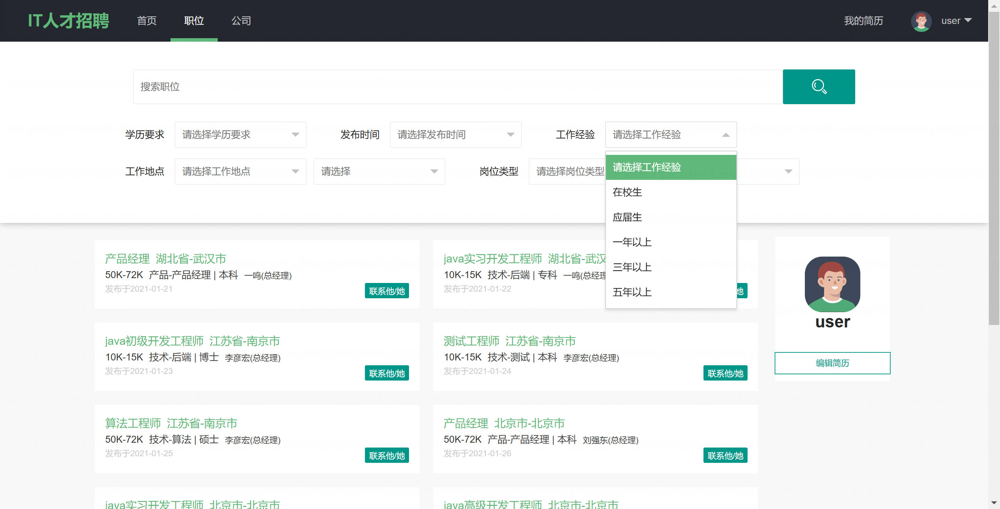

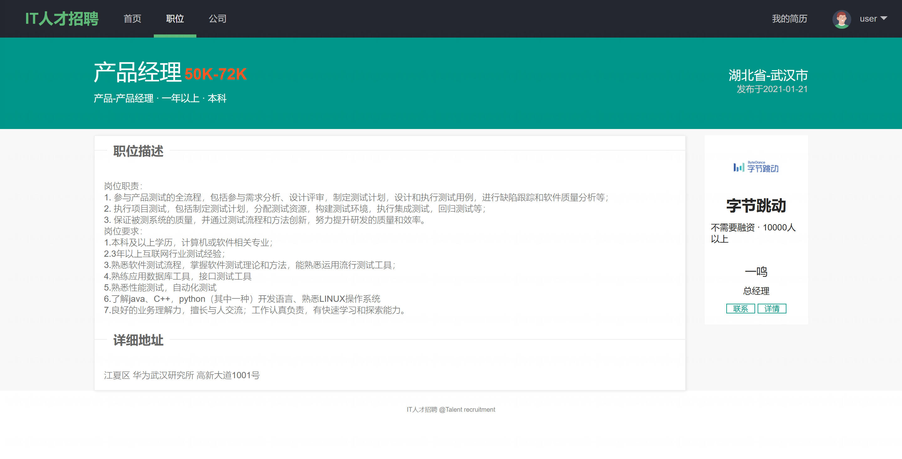

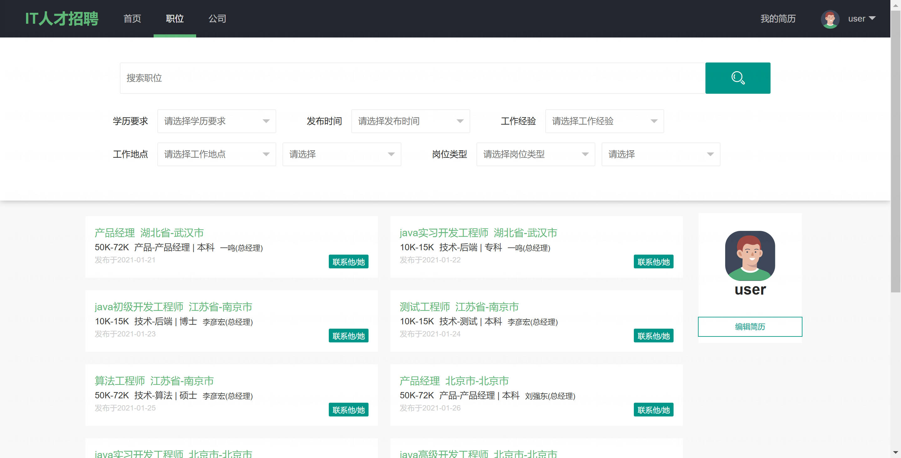

